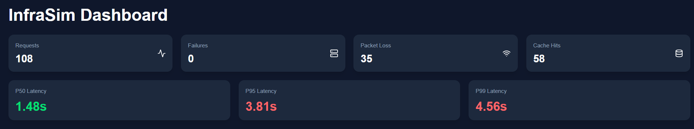
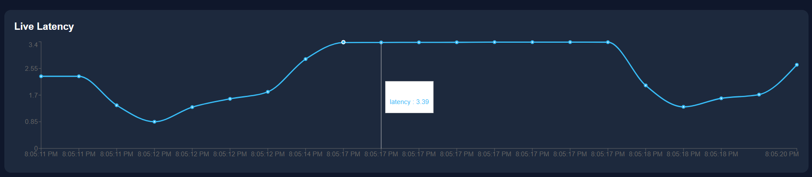
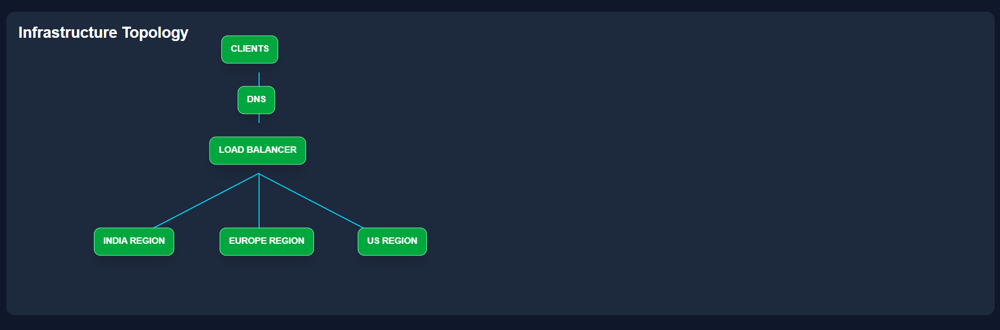
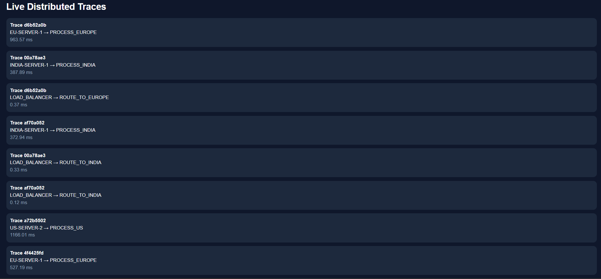
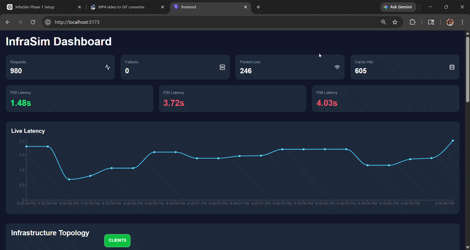

# InfraSim

A real-time distributed systems simulator modeling how modern internet infrastructure works internally.

InfraSim simulates:
- DNS resolution
- Load balancing
- Packet routing
- Geo-routing
- Server failures
- Retry mechanisms
- Distributed tracing
- Caching systems
- WebSocket telemetry
- Observability dashboards
- Chaos engineering concepts

Built using:
- Python asyncio
- FastAPI
- WebSockets
- React
- TailwindCSS

---

# Preview
(Given Below. Kindly Scroll Down)

# Features

## Core Distributed Systems Simulation

- Async request flow
- Packet-based request simulation
- DNS resolution
- Load balancing
- Packet routing
- Regional traffic handling

---

## Fault Tolerance & Reliability

- Packet loss simulation
- Retry mechanisms
- Server crash simulation
- Self-healing infrastructure
- Regional failover routing

---

## Observability & Monitoring

- Live telemetry streaming
- WebSocket-based updates
- Real-time metrics dashboard
- Infrastructure health monitoring
- Distributed tracing
- Latency visualization

---

## Caching Systems

- DNS cache simulation
- Cache hit/miss tracking
- TTL expiration
- Latency optimization

---

## Geo-Distributed Infrastructure

Supported regions:
- India
- US
- Europe

Features:
- latency-aware routing
- nearest-region selection
- regional failover

---

## Chaos Engineering

InfraSim supports production-style fault injection concepts:
- server crashes
- packet loss
- latency spikes
- infrastructure degradation

Inspired by:
- Netflix Chaos Monkey
- SRE resiliency testing
- distributed reliability engineering

---

# Architecture

```text
CLIENTS
   ↓
DNS RESOLVER
   ↓
LOAD BALANCER
   ↓
GEO ROUTER
   ↓
REGIONAL SERVERS
   ↓
OBSERVABILITY PIPELINE
   ↓
WEBSOCKET TELEMETRY
   ↓
REACT DASHBOARD
```

---

# Distributed Systems Concepts Demonstrated

InfraSim demonstrates real engineering concepts used by companies like:
- Cloudflare
- AWS
- Netflix
- Google

## Concepts Covered

| Concept | Description |
|---|---|
| Async Architecture | asyncio-based concurrent simulation |
| Fault Tolerance | retries, failovers, self-healing |
| Observability | telemetry + metrics streaming |
| Distributed Tracing | request journey tracking |
| Caching | DNS cache + TTL |
| Geo Routing | region-aware traffic routing |
| Real-Time Telemetry | WebSocket infrastructure |
| Chaos Engineering | infrastructure fault injection |
| Infrastructure Visualization | topology + monitoring UI |

---

# Tech Stack

## Backend

- Python
- asyncio
- FastAPI
- Uvicorn
- WebSockets

---

## Frontend

- React
- TailwindCSS
- Recharts
- Framer Motion

---

## Observability

- Distributed tracing
- Real-time telemetry
- Metrics aggregation
- Infrastructure topology visualization

---

# Project Structure

```text
InfraSim/
│
├── backend/
│   ├── app.py
│   └── event_stream.py
│
├── cache/
│   └── dns_cache.py
│
├── clients/
│   └── client.py
│
├── core/
│   ├── exceptions.py
│   ├── logger.py
│   └── packet.py
│
├── infrastructure/
│   └── server.py
│
├── network/
│   ├── dns.py
│   ├── geo_router.py
│   └── load_balancer.py
│
├── observability/
│   ├── dashboard.py
│   └── metrics.py
│
├── tracing/
│   └── tracer.py
│
├── frontend/
│
├── simulation.py
├── main.py
├── requirements.txt
├── README.md
└── .env.example
```

---

# Setup Instructions

## 1. Clone Repository

```bash
git clone https://github.com/theanamsaqib/InfraSim
cd InfraSim
```

---

## 2. Create Virtual Environment

### Windows

```bash
python -m venv venv
venv\\Scripts\\activate
```

### Linux / macOS

```bash
python3 -m venv venv
source venv/bin/activate
```

---

## 3. Install Backend Dependencies

```bash
pip install -r requirements.txt
```

---

## 4. Install Frontend Dependencies

```bash
cd frontend
npm install
```

---

## 5. Configure Environment Variables

Create:

```text
.env
```

Example:

```env
PACKET_LOSS_RATE=0.2
SERVER_FAILURE_RATE=0.1
CACHE_TTL=5
SIMULATION_INTERVAL=3
```

---

## 6. Start Backend

From project root:

```bash
python main.py
```

Backend runs at:

```text
http://127.0.0.1:8000
```

---

## 7. Start Frontend

Inside frontend folder:

```bash
npm run dev
```

Frontend runs at:

```text
http://localhost:5173
```

---

# Dashboard Features

## Live Metrics

- request throughput
- failures
- packet loss
- cache hits
- latency tracking

---

## Infrastructure Topology

Visualizes:
- clients
- DNS
- load balancer
- regional servers
- infrastructure health

---

## Distributed Traces

Tracks:
- DNS resolution spans
- load balancing spans
- server processing spans

Inspired by:
- Jaeger
- OpenTelemetry
- Datadog APM

---

# Engineering Highlights

## Real-Time Event Streaming

InfraSim uses:
- WebSockets
- async telemetry pipelines
- event-driven architecture

instead of polling.

---

## Self-Healing Infrastructure

Servers:
- crash randomly
- recover automatically
- reroute traffic dynamically

Simulating real infrastructure resiliency systems.

---

## Infrastructure Simulation

InfraSim is intentionally modeled after concepts used in:
- CDNs
- cloud platforms
- edge infrastructure
- observability tooling

---

# Screenshots

## Dashboard



---

## Topology Visualization



---


## Distributed Tracing



---

## Demo
# Demo




